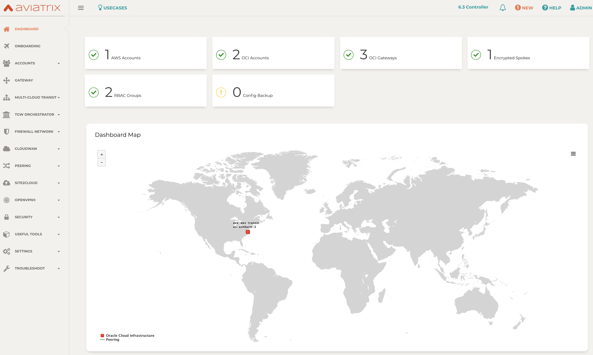
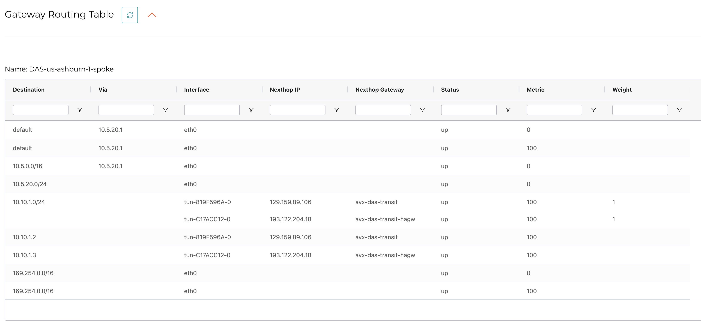

# Aviatrix OCI CIS Region 1

### Description
This repo deploys the infrastructure of the CIS OCI Landing zone, onboards an OCI account to Aviatrix Controller, creates an Aviatrix Spoke peered with an Aviatrix Transit in HA.
The pattern can be repeated in any region necessary to simplify peering and extend the network to any Cloud.

### Compatibility
Terraform version | Controller version | Terraform provider version
:--- | :--- | :---
0.13 | 6.3 (patch1) | 2.18

### Variables

Modify ```terraform.tfvars``` as needed for your configuration.

### Dependencies

- Software version requirements met
- Aviatrix Controller with 6.3 Patch 1 or higher available
- Sufficient limits in place for CSPs and regions in scope **_(EIPs, Compute quotas, etc.)_**
- Terraform .13 in the user environment ```terraform -v```
- Terraform OCI provider requirements are met in the runtime environment

### Workflow

- Modify ```terraform.tfvars``` as needed
- ```terraform init```
- ```terraform plan```
- ```terraform apply --auto-approve```


### Controller Dashboard (post-provisioning)



### Aviatrix Spoke Gateway Routing Table



### Known issues
- Some .tf files have a .bak extension to avoid running into limits on repeat runs, simply change the extension back to .tf if interested
- After provisioning there is a configuration drift in terraform state because Aviatrix begins programming the route tables. Need to add some lifecycle changes to sec lists and route tables to affected resources, i.e. ```lifecycle {ignore_changes = [oci_security_lists]}```


### Terraform state (post-provisioning)

```
$ terraform state list
$ tf13 state list
aviatrix_account.oci_account
aviatrix_spoke_gateway.oci_spoke
oci_core_default_security_list.default_security_list
oci_core_route_table.aviatrix_route_table
oci_core_security_list.aviatrix_security_list
oci_core_subnet.aviatrix_subnet
module.aviatrix_oci_transit.aviatrix_transit_gateway.default
module.aviatrix_oci_transit.aviatrix_vpc.default
module.cis_appdev_admins.data.oci_identity_users.these
module.cis_appdev_admins.oci_identity_group.this
module.cis_appdev_admins.oci_identity_policy.this
module.cis_compartments.data.oci_identity_compartments.these
module.cis_compartments.oci_identity_compartment.these["DAS-AppDev"]
module.cis_compartments.oci_identity_compartment.these["DAS-Database"]
module.cis_compartments.oci_identity_compartment.these["DAS-Network"]
module.cis_compartments.oci_identity_compartment.these["DAS-Security"]
module.cis_database_admins.data.oci_identity_users.these
module.cis_database_admins.oci_identity_group.this
module.cis_database_admins.oci_identity_policy.this
module.cis_flow_logs.oci_logging_log.these["DAS-Private-Subnet-App"]
module.cis_flow_logs.oci_logging_log.these["DAS-Private-Subnet-DB"]
module.cis_flow_logs.oci_logging_log.these["DAS-Public-Subnet"]
module.cis_flow_logs.oci_logging_log_group.this
module.cis_iam_admins.data.oci_identity_users.these
module.cis_iam_admins.oci_identity_group.this
module.cis_iam_admins.oci_identity_policy.this
module.cis_network_admins.data.oci_identity_users.these
module.cis_network_admins.oci_identity_group.this
module.cis_network_admins.oci_identity_policy.this
module.cis_network_topic.oci_ons_notification_topic.this
module.cis_network_topic.oci_ons_subscription.these["s1"]
module.cis_notification_iam_group_changes.oci_events_rule.this
module.cis_notification_iam_policy_changes.oci_events_rule.this
module.cis_notification_iam_user_changes.oci_events_rule.this
module.cis_notification_idp_changes.oci_events_rule.this
module.cis_notification_idp_group_mappings_changes.oci_events_rule.this
module.cis_notification_network_gateways_changes.oci_events_rule.this
module.cis_notification_nsg_changes.oci_events_rule.this
module.cis_notification_route_table_changes.oci_events_rule.this
module.cis_notification_security_list_changes.oci_events_rule.this
module.cis_notification_vcn_changes.oci_events_rule.this
module.cis_nsgs.data.oci_core_network_security_groups.this
module.cis_nsgs.oci_core_network_security_group.these["DAS-NSG-App"]
module.cis_nsgs.oci_core_network_security_group.these["DAS-NSG-Bastion"]
module.cis_nsgs.oci_core_network_security_group.these["DAS-NSG-DB"]
module.cis_nsgs.oci_core_network_security_group.these["DAS-NSG-LBR"]
module.cis_nsgs.oci_core_network_security_group_security_rule.egress_rules_tcp_no_src_dst[0]
module.cis_nsgs.oci_core_network_security_group_security_rule.egress_rules_tcp_no_src_dst[1]
module.cis_nsgs.oci_core_network_security_group_security_rule.egress_rules_tcp_no_src_dst[2]
module.cis_nsgs.oci_core_network_security_group_security_rule.egress_rules_tcp_no_src_dst[3]
module.cis_nsgs.oci_core_network_security_group_security_rule.egress_rules_tcp_no_src_dst[4]
module.cis_nsgs.oci_core_network_security_group_security_rule.egress_rules_tcp_no_src_dst[5]
module.cis_nsgs.oci_core_network_security_group_security_rule.ingress_rules_tcp_no_src_dst[0]
module.cis_nsgs.oci_core_network_security_group_security_rule.ingress_rules_tcp_no_src_dst[1]
module.cis_nsgs.oci_core_network_security_group_security_rule.ingress_rules_tcp_no_src_dst[2]
module.cis_nsgs.oci_core_network_security_group_security_rule.ingress_rules_tcp_no_src_dst[3]
module.cis_nsgs.oci_core_network_security_group_security_rule.ingress_rules_tcp_no_src_dst[4]
module.cis_nsgs.oci_core_network_security_group_security_rule.ingress_rules_tcp_no_src_dst[5]
module.cis_nsgs.oci_core_network_security_group_security_rule.ingress_rules_tcp_no_src_dst[6]
module.cis_security_admins.data.oci_identity_users.these
module.cis_security_admins.oci_identity_group.this
module.cis_security_admins.oci_identity_policy.this
module.cis_security_lists.data.oci_core_network_security_groups.this
module.cis_security_lists.oci_core_security_list.these["DAS-Private-Subnet-App-Security-List"]
module.cis_security_lists.oci_core_security_list.these["DAS-Private-Subnet-DB-Security-List"]
module.cis_security_lists.oci_core_security_list.these["DAS-Public-Subnet-Security-List"]
module.cis_security_topic.oci_ons_notification_topic.this
module.cis_security_topic.oci_ons_subscription.these["s1"]
module.cis_tags.data.oci_identity_tag_defaults.these
module.cis_tags.data.oci_identity_tag_namespaces.this
module.cis_tags.data.oci_identity_tags.these
module.cis_tenancy_auditors.data.oci_identity_users.these
module.cis_tenancy_auditors.oci_identity_group.this
module.cis_tenancy_auditors.oci_identity_policy.this
module.cis_vcn.data.oci_core_services.all_services
module.cis_vcn.oci_core_internet_gateway.this
module.cis_vcn.oci_core_nat_gateway.this
module.cis_vcn.oci_core_route_table.these["DAS-Private-Subnet-App-Route"]
module.cis_vcn.oci_core_route_table.these["DAS-Private-Subnet-DB-Route"]
module.cis_vcn.oci_core_route_table.these["DAS-Public-Subnet-Route"]
module.cis_vcn.oci_core_service_gateway.this
module.cis_vcn.oci_core_subnet.these["DAS-Private-Subnet-App"]
module.cis_vcn.oci_core_subnet.these["DAS-Private-Subnet-DB"]
module.cis_vcn.oci_core_subnet.these["DAS-Public-Subnet"]
module.cis_vcn.oci_core_vcn.this

```